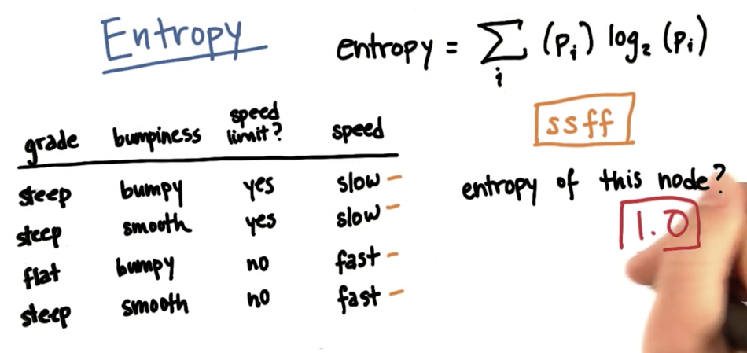
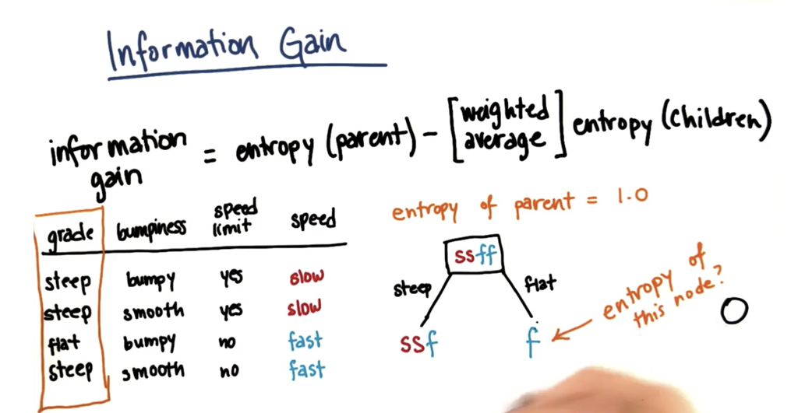
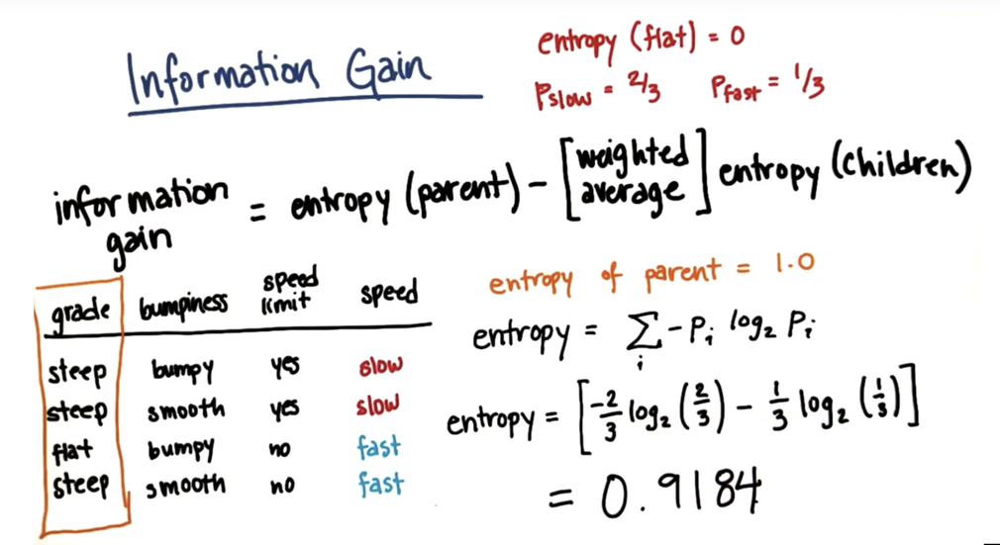
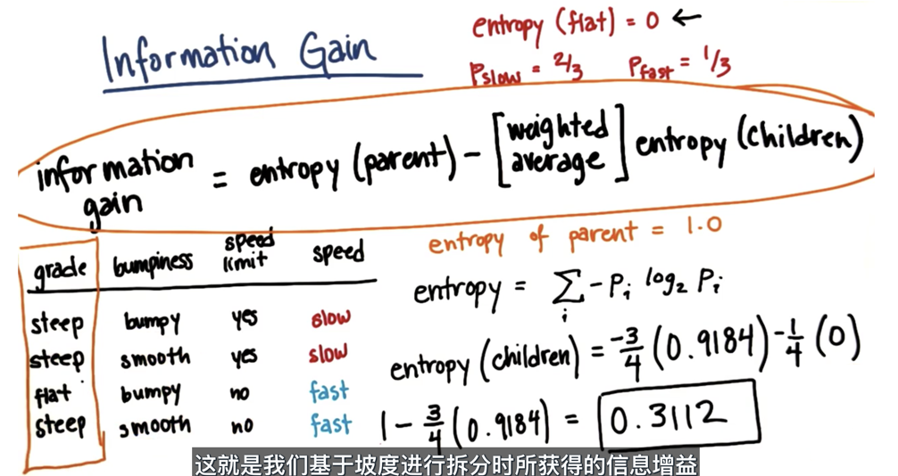
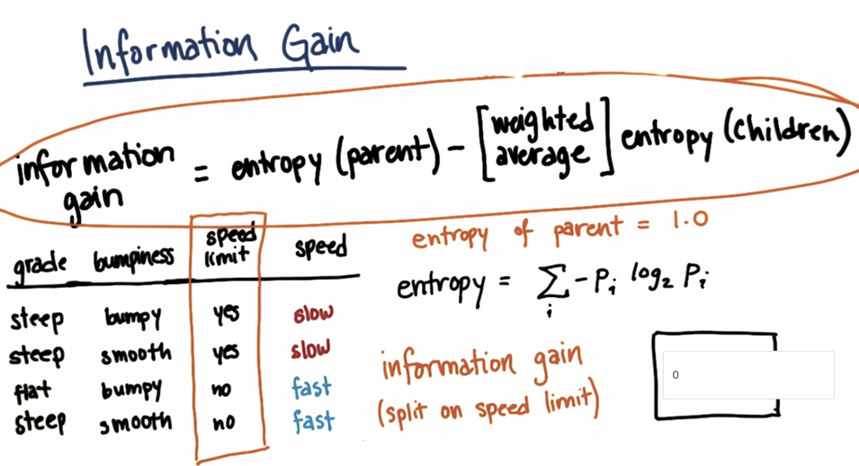
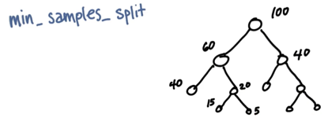
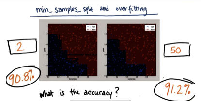

# 决策树

## 决策数的构造


### 熵和信息增益

​        划分数据集的大原则是：将无序的数据变得更加有序。划分数据的方式有很多种，但是每种都有相应的优缺点。组织杂乱无章数据的一种方式就是使用信息论度量信息。在划分数据集之前之后信息发生的变化称为**信息增益**.
集合信息的度量方式称为香农熵或者简称熵
如果待分类的事物可能划分在多个分类之中，则符号
$$
x_{i}
$$
的信息定义为

$$
l(x_{i})=-\log_{2}p(x_{i})
$$


其中$$p(x_{i})$$是选择该分类的概率
为了计算熵，我们需要计算所有类别所有可能包含值的信息期望值

$$
H=-\sum_{i=1}^{n}p(x_{i})log_{2}p(x_{i})
$$

Eg：计算熵



下面用代码来实现计算数据集合的香农熵

```python
from math import log

def calcShannonEnt(dataSet):
    numEntries = len(dataSet)
    lableCounts = {}
    for featVec in dataSet:
        currentLable = featVec[-1]
        if currentLable not in lableCounts.keys():
            lableCounts[currentLable] = 0
        lableCounts[currentLable] += 1

    shannonENt = 0.0
    for key in lableCounts:
        prob = float(lableCounts[key])/ numEntries
        shannonENt = -= prob * log(prob, 2)
    return shannonENt
```





熵的计算


计算信息增益



如图所示：计算关于速度的信息增益，因为如果以速度划分，熵为0，由于父数据集的熵为1，所以信息增益为1.这个是一个最好的信息增益，所以应该从这里划分数据集。




在ipython里面找一个集合测试一下：

```sh
In [1]: import trees

In [2]: myDat, lables = trees.createDataSet()

In [3]: myDat
Out[3]: [[1, 1, 'yes'], [1, 1, 'yes'], [1, 0, 'no'], [0, 1, 'no'], [0, 1, 'no']]

In [4]: lables
Out[4]: ['no surfacing', 'flippers']

In [5]: trees.calcShannonEnt(myDat)
Out[5]: 0.9709505944546686
```
香农熵的计算还是比较简单的，但是使用比较复杂

### 划分数据集

在前面介绍了如何度量集合的无序程度，这里还需要来划分数据集，然后来度量数据集的熵，来看是否正确的划分了数据集。
下面的代码实现了集合的划分

```python
def splitDataSet(dataSet, axis, value):
    retDataSet = []
    for featVec in dataSet:
        if featVec[axis] == value:
            reducedFeatVec = featVec[:axis]
            reducedFeatVec.extend(featVec[axis+1:])
            retDataSet.append(reducedFeatVec)
    return retDataSet
```

来看一下splitDataSet(dataSet, axis, value)这个函数，需要3个参数：待划分的数据集、划分数据集的特征、需要返回的特征值。

```sh
In [1]: import trees

In [2]: myDat, labels = trees.createDataSet()

In [3]: myDat
Out[3]: [[1, 1, 'yes'], [1, 1, 'yes'], [1, 0, 'no'], [0, 1, 'no'], [0, 1, 'no']]

In [4]: trees.splitDataSet(myDat, 0, 1)
Out[4]: [[1, 'yes'], [1, 'yes'], [0, 'no']]

In [5]: trees.splitDataSet(myDat, 0, 0)
Out[5]: [[1, 'no'], [1, 'no']]
```

下面 来选择最好的数据划分方式

```python
def chooseBestFeatureToSplit(dataSet):
    numFeatures = len(dataSet[0]) - 1
    baseEntropy = calcShannonEnt(dataSet)
    bestInfoGain = 0.0; bestFeature = -1
    for i in range(numFeatures):
        featList = [example[i] for example in dataSet]
        uniqueVals = set(featList)
        newEntropy = 0.0
        for value in uniqueVals:
            subDataSte = splitDataSet(dataSet, i, value)
            prob = len(subDataSte) / float(len(dataSet))
            newEntropy += prob * calcShannonEnt(subDataSte)
        infoGain = baseEntropy - newEntropy
        if (infoGain > bestInfoGain):
            bestInfoGain = infoGain
            bestFeature = i
    return bestFeature
```

这段代码实现了选取特征，划分数据集，计算得出最好的划分数据集的特征。这样划分的意义所在


| id   | 不浮出水面是否可以生存 | 是否有脚蹼 | 属于鱼类 |
| :--- | :---------- | :---- | :--- |
| 1    | 是           | 是     | 是    |
| 2    | 是           | 是     | 是    |
| 3    | 是           | 否     | 否    |
| 4    | 否           | 是     | 否    |
| 5    | 否           | 是     | 否    |


```sh
In [1]: import trees

In [2]: myDat, labels = trees.createDataSet()

In [3]: myDat
Out[3]: [[1, 1, 'yes'], [1, 1, 'yes'], [1, 0, 'no'], [0, 1, 'no'], [0, 1, 'no']]

In [4]: trees.chooseBestFeatureToSplit(myDat)
Out[4]: 0
```

通个这个结论，可以看到使用第0个特征是最好的划分方式。结合上表来分析一下。如果按照第一个特征划分数据，则第一组值为1(是)的分一组，否(0)为另一组。‘1’组里面包含两个鱼类和一个非鱼类。‘0’组里面只有非鱼类。

## 递归构建决策数

构建决策树代码如下：

```python
def majorityCnt(classList):
    classCount = {}
    for vote in classList:
        if vote not in classCount.keys(): classCount[vote] = 0
        classCount += 1
        sortedClassCount = sorted(classCount.iteritems(), \
            key=operator.itemgetter(1), reverse=True)
        return sortedClassCount[0][0]

def createTree(dataSet, labels):
    classList = [example[i] for example in dataSet]
    if classList.count(classList[0]) == len(classList):
        return classList[0]
    if len(dataSet[0]) == 1:
        return majorityCnt(classList)
    bestFeat = chooseBestFeatureToSplit(dataSet)
    bestFeatLabel = labels[bestFeat]
    myTree = {bestFeatLabel:{}}
    del(labels[bestFeat])
    featValues = [example[bestFeat] for example in dataSet]
    uniqueVals = set(featValues)
    for value in uniqueVals:
        subLabels = labels[:]
        myTree[bestFeatLabel][value] = createTree(splitDataSet \
            (dataSet, bestFeat, value), subLabels)
    return myTree
```

`createTree(dataSet, labels)`这个函数有两个参数：数据集和标签列表。
递归终止的两个条件：1、所有标签都相同。2、使用完了所有的特征。
这里使用了字典来存储了树的信息。

## 测试和存储分类器

### 测试算法：使用决策树执行分类

代码如下：

```python
def classify(inputTree, featLabels, testVec):
    firstStr = inputTree.keys()[0]
    secondDict = inputTree[firstStr]
    featIndex = featLabels.index(firstStr)
    for key in secondDict.keys():
        if testVec[featIndex] == key:
            if type(secondDict[key]).__name__ == 'dict':
                classLabel = classify(secondDict[key], featLabels, testVec)
            else: classLabel = secondDict[key]
    return classLabel
```


## 使用算法：决策数的存储
使用pickle模块存储决策树，序列化对象可以在磁盘上保存对象。并且在需要的时候读取。任何对象都支持序列化操作。


## sklearn 决策树分类

```
In [1]: from sklearn import tree

In [2]: x = [[0,0], [1, 1]]

In [3]: y = [0, 1]

In [4]: clf = tree.DecisionTreeClassifier(
   ...: )

In [5]: clf.fit(x, y)
Out[5]:
DecisionTreeClassifier(class_weight=None, criterion='gini', max_depth=None,
            max_features=None, max_leaf_nodes=None,
            min_impurity_split=1e-07, min_samples_leaf=1,
            min_samples_split=2, min_weight_fraction_leaf=0.0,
            presort=False, random_state=None, splitter='best')

In [6]: clf.predict([0,0])
Out[6]: array([0])
```

### 调节参数提高准确率
`min_samples_split` 最少分割样本,分割的最小的样本数量






## 决策树优缺点

缺点： 容易过度拟合
