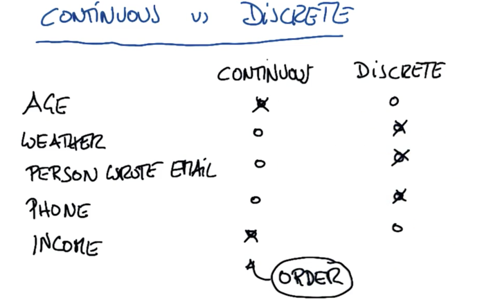
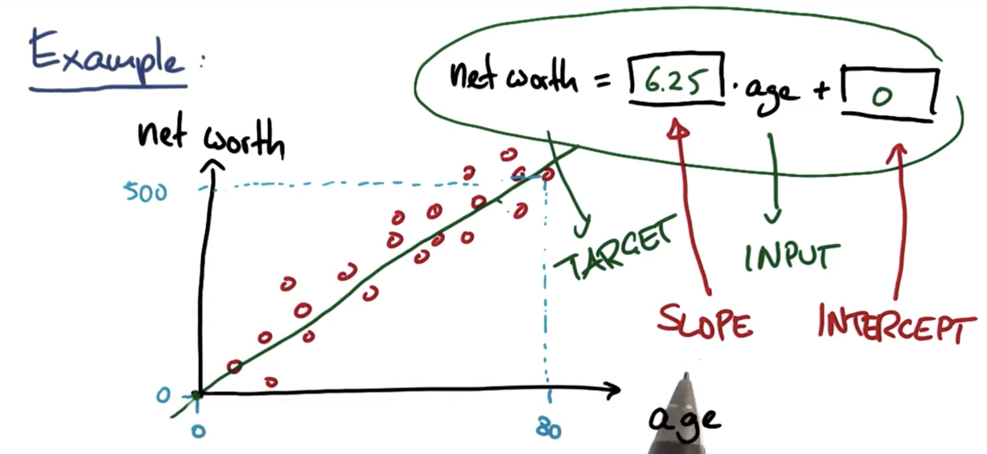
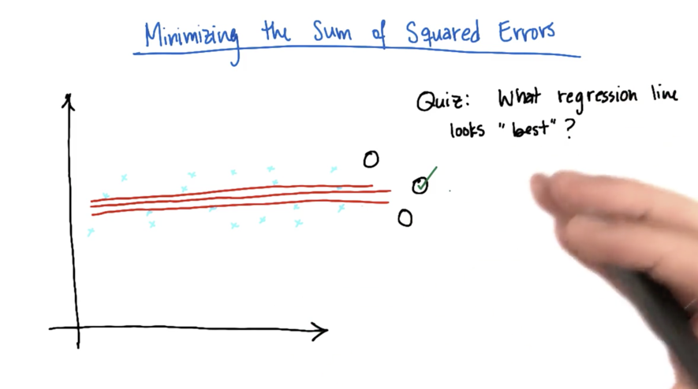
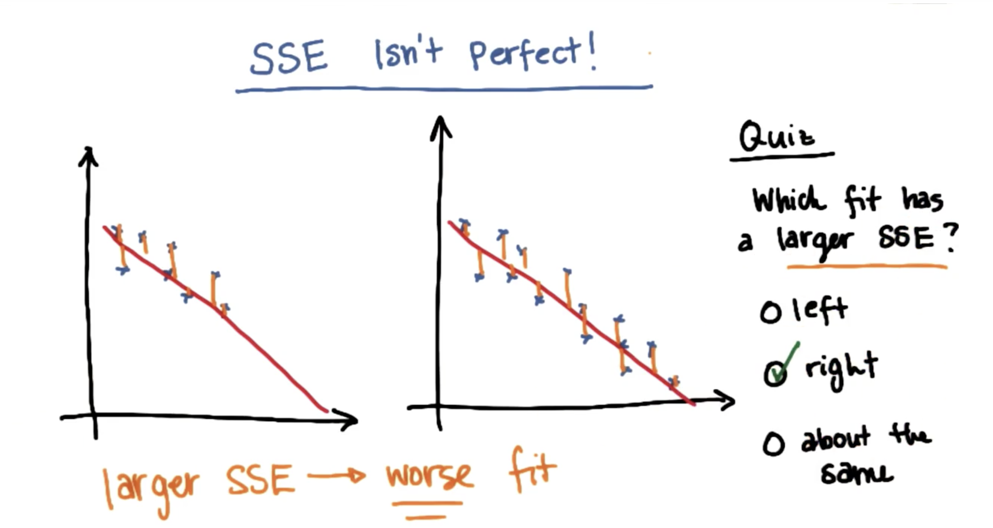

# 回归


## 连续监督学习

* 连续输出和离散输出的区别

这里的连续主要是指输出是连续的



## 回归线性方程



slope：斜率
intercept：截距

### 斜率和截距

斜率越大，上升越快


## Sklearn中的线形拟合


```python
>>> from sklearn import linear_model
>>> reg = linear_model.LinearRegression()
>>> reg.fit ([[0, 0], [1, 1], [2, 2]], [0, 1, 2])
LinearRegression(copy_X=True, fit_intercept=True, n_jobs=1, normalize=False)
>>> reg.coef_
array([ 0.5,  0.5])
```


### 线性回归误差

使误差有最小值。

#### 最小二乘法（OLS）

`sklearn`中的线性拟合即使用的是该方法

```
import numpy as np
import matplotlib.pyplot as plt

dots = np.array([[1,6], [2,5], [3,7], [4,10], [5, 12]])

X = dots[:, 0]
Y = dots[:, 1]
plt.scatter(X, Y, color = "b", label="fast")


def nihe(k, x, b):
    return k*x + b


#a0 = （∑Yi) / n - a1（∑Xi) / n （式1-8)
#a1 = [n∑Xi Yi - （∑Xi ∑Yi)] / [n∑Xi2 - （∑Xi)2 )] （式1-9)

n = dots.shape[0]
a1 = (n*sum(X*Y) - sum(X)*sum(Y)) / (n*sum(X**2)-(sum(X)**2))
a0 = sum(Y)/n - a1*(sum(X))/n
print(a0, a1)

R_Y = [nihe(a1, x, a0) for x in X]
plt.plot(X, R_Y)
plt.show()
```

##### 使用平方误差和来评估拟合的效果？



​        如上图所示，如果只是使用绝对值，那么途中的3种拟合方式没有什么区别，然而如果使用平方的方式，只有中间的误差是最小的。

* 使用平方误差和的方式的不足只处
  

##### R平方指标

R平方指标弥补了平方误差和的不足之处。


#### 梯度下降法


### 什么数据适用于线性回归

线性的，可以拟合成
$$
y = ax + b
$$

### 回归于分类的比较

|      |          |        |
| ---- | -------- | ------ |
| 比较   | 监督分类     | 回归     |
| 输出类型 | 离散（类型标签） | 连续（数字） |
| 目的   | 找到决策边界   | 最优拟合线  |
| 评估指标 | 准确率      | R平方值   |


## 多变量（多元）回归（MULTI-VARIATE REGRESSION)

