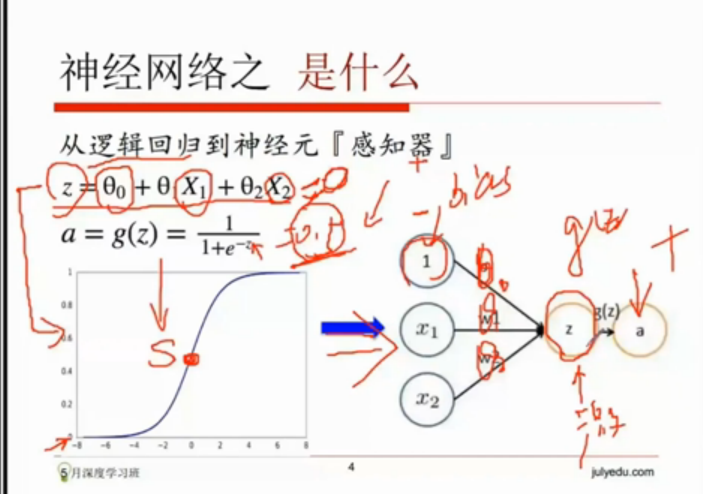

# 深度学习


## Logistic 函数

​        **Logistic函数或Logistic曲线**是一种常见的S形函数，它是皮埃尔·弗朗索瓦·韦吕勒在1844或1845年在研究它与人口增长的关系时命名的。广义Logistic曲线可以模仿一些情况人口增长（*P*）的S形曲线。起初阶段大致是[指数增长](http://baike.baidu.com/item/%E6%8C%87%E6%95%B0%E5%A2%9E%E9%95%BF)；然后随着开始变得饱和，增加变慢；最后，达到成熟时增加停止。[1][ ]()

很像一个“S”型吧，所以又叫 sigmoid曲线（S型曲线）。
$$
y=\sigma(z)
$$
$\sigma$ 的定义为
$$
\sigma={1\over 1+e^{-z}}
$$
python实现Logistic函数

```
import numpy as np
import matplotlib.pyplot as plt


def logistic(z):
    return 1 / (1 + np.exp(-z))

# Plot the logistic function
z = np.linspace(-6,6,100)
plt.plot(z, logistic(z), 'b-')
plt.xlabel('$z$', fontsize=15)
plt.ylabel('$\sigma(z)$', fontsize=15)
plt.title('logistic function')
plt.grid()
plt.show()
```


## Logistic函数的导数

```
def logistic_derivative(z):
	return logistic(z) * (1 - logistic(z))
# Plot the derivative of the logistic function
z = np.linspace(-6,6,100)
plt.plot(z, logistic_derivative(z), 'r-')
plt.xlabel('$z$', fontsize=15)
plt.ylabel('$\\frac{\\partial \\sigma(z)}{\\partial z}$', fontsize=15)
plt.title('derivative of the logistic function')
plt.grid()
plt.show()

```


## Logistic回归

​        logistic回归是一种广义线性回归（generalized linear model），因此与多重线性回归分析有很多相同之处。它们的模型形式基本上相同，都具有 $w‘x+b$，其中w和b是待求参数，其区别在于他们的[因变量](http://baike.baidu.com/item/%E5%9B%A0%E5%8F%98%E9%87%8F)不同，多重线性回归直接将w'x+b作为因变量，即y =w‘x+b，而logistic回归则通过函数L将w‘x+b对应一个隐状态p，p =L(w‘x+b),然后根据p 与1-p的大小决定因变量的值。如果L是logistic函数，就是logistic回归，如果L是多项式函数就是多项式回归。

## 训练一个Logistic回归训练器


```
"""Softmax."""

scores = [3.0, 1.0, 0.2]

import numpy as np

def softmax(x):
    """Compute softmax values for each sets of scores in x."""
    pass  # TODO: Compute and return softmax(x)
    return np.exp(x) / np.sum(np.exp(x), axis=0)


print(softmax(scores))

# Plot softmax curves
import matplotlib.pyplot as plt
x = np.arange(-2.0, 6.0, 0.1)
scores = np.vstack([x, np.ones_like(x), 0.2 * np.ones_like(x)])

plt.plot(x, softmax(scores).T, linewidth=2)
plt.show()

```


## 训练集合



